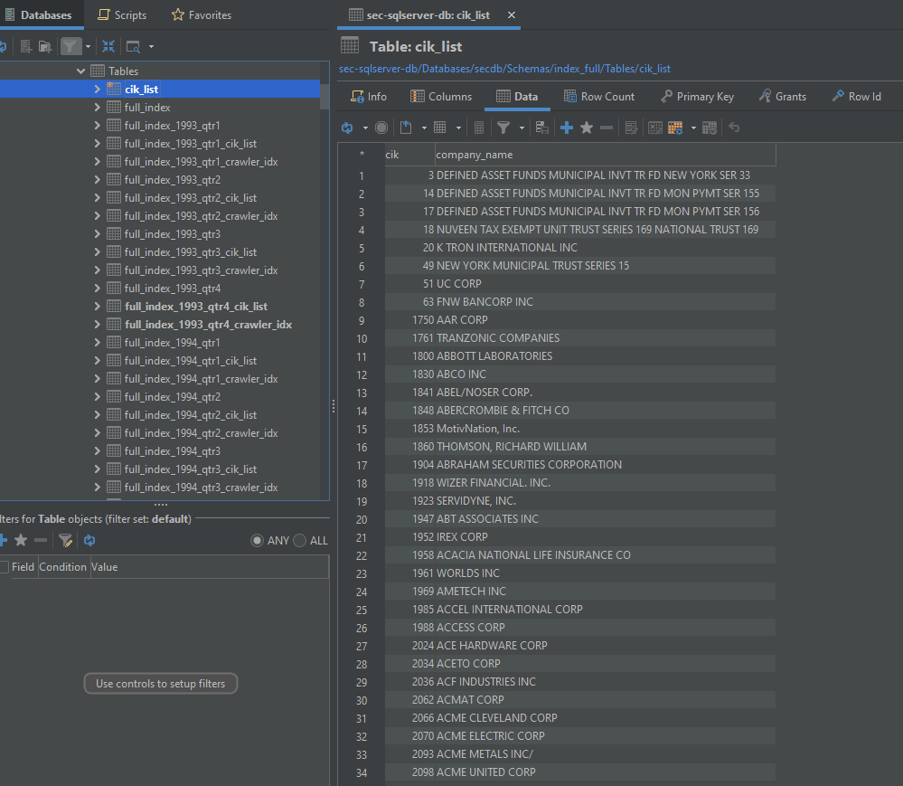
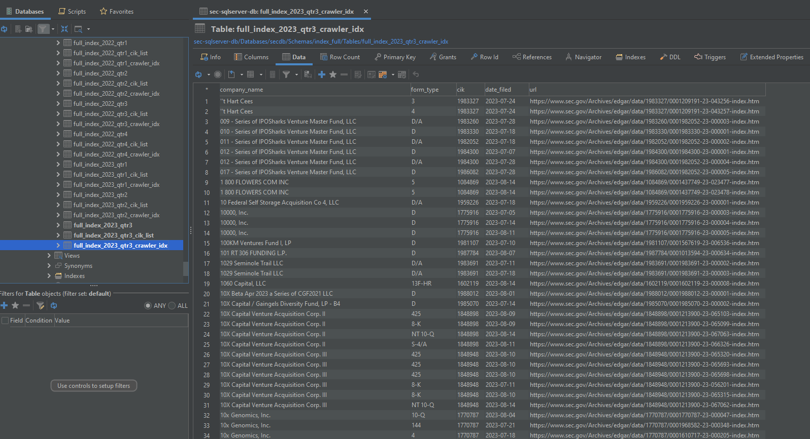

# SEC_Full_Index_To_Docker_SQL_Server

# INSTALL DOCKER DESKTOP (Windows): https://docs.docker.com/desktop/install/windows-install/

# POWERSHELL [PS >]

# CREATE AND RUN SQL SERVER INSTANCE ON DOCKER
docker run --name sec-sqlserver-db `
 -e "ACCEPT_EULA=Y" `
 -e "SA_PASSWORD=Mypass123456" `
 -p 1433:1433 `
 -d mcr.microsoft.com/mssql/server:2019-latest
 
# CONFIRM DOCKER IS RUNNING
docker ps

# CREATE NEW PROJECT DIRECTORY
New-Item -ItemType Directory sec-sqlserver-db

# CHANGE DIRECTORY
cd sec-sqlserver-db

# CREATE VIRTUAL ENVIRONMENT
py -m venv venv

# ACTIVATE VIRTUAL ENVIRONMENT [(venv) PS >]
.\venv\Scripts\Activate

# INSTALL REQUIRED LIBRARIES
pip install pyodbc requests pandas

# DOWNLOAD A COPY OF main.py AND PLACE IN VIRTUAL ENVIRONMENT
[main.py](https://github.com/TranDenyDFW/SEC_Full_Index_To_Docker_SQL_Server/blob/main/main.py)

# RUN main.py
py main.py

# EXPLORE DATA

# DO SOMETHING WITH DATA
...

# TODO
INSERT DATA IN BATCHES TO INCREASE EFFICIENCY
